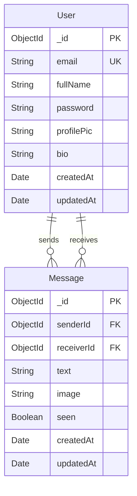

QuickChat uses MongoDB as its database, with Mongoose for object modeling and schema validation. The database stores two primary collections: Users and Messages.

## Database connection

The application connects to MongoDB using Mongoose:

```javascript
// server/lib/db.js
import mongoose from "mongoose";

export const connectDB = async () => {
  try {
    mongoose.connection.on("connected", () =>
      console.log("Database Connected")
    );

    await mongoose.connect(`${process.env.MONDODB_URI}/chat-app`);
  } catch (error) {
    console.log(error.message);
  }
};
```

<Note>
The database name is `chat-app` and the connection URI is configured via the `MONDODB_URI` environment variable.
</Note>

## User model

The User model stores user account information and profiles.

### Schema definition

```javascript
// server/models/user.js
import mongoose from "mongoose";

const userSchema = new mongoose.Schema(
  {
    email: {
      type: String,
      required: true,
      unique: true,
    },
    fullName: {
      type: String,
      required: true,
    },
    password: {
      type: String,
      required: true,
      minlength: 6,
    },
    profilePic: {
      type: String,
      default: "",
    },
    bio: {
      type: String,
    },
  },
  { timestamps: true }
);

const User = mongoose.model("User", userSchema);
export default User;
```

### Field reference

<ParamField path="email" type="String" required>
  User's email address. Must be unique across all users. Used for authentication and account identification.
</ParamField>

<ParamField path="fullName" type="String" required>
  User's display name shown in the chat interface and user lists.
</ParamField>

<ParamField path="password" type="String" required>
  Hashed password for authentication. Minimum length of 6 characters enforced at schema level.
  
  <Warning>
  This field should be excluded from API responses using `.select("-password")` to prevent exposure.
  </Warning>
</ParamField>

<ParamField path="profilePic" type="String" default="">
  URL to the user's profile picture, typically hosted on Cloudinary. Defaults to empty string if not provided.
</ParamField>

<ParamField path="bio" type="String">
  Optional user biography or status message displayed in their profile.
</ParamField>

<ParamField path="createdAt" type="Date" auto>
  Automatically generated timestamp when the user account was created. Added by `timestamps: true` option.
</ParamField>

<ParamField path="updatedAt" type="Date" auto>
  Automatically updated timestamp when the user document was last modified. Added by `timestamps: true` option.
</ParamField>

### Usage examples

**Query users excluding passwords:**

```javascript
const users = await User.find({ _id: { $ne: userId } })
  .select("-password");
```

**Find user by email:**

```javascript
const user = await User.findOne({ email: "user@example.com" });
```

## Message model

The Message model stores all chat messages between users, including text and image content.

### Schema definition

```javascript
// server/models/message.js
import mongoose from "mongoose";

const messageSchema = new mongoose.Schema(
  {
    senderId: {
      type: mongoose.Schema.Types.ObjectId,
      ref: "User",
      required: true,
    },
    receiverId: {
      type: mongoose.Schema.Types.ObjectId,
      ref: "User",
      required: true,
    },
    text: { type: String },
    image: { type: String },
    seen: { type: Boolean, default: false },
  },
  { timestamps: true }
);

const Message = mongoose.model("Messages", messageSchema);
export default Message;
```

### Field reference

<ParamField path="senderId" type="ObjectId" required>
  Reference to the User who sent the message. Links to the `_id` field in the User collection.
</ParamField>

<ParamField path="receiverId" type="ObjectId" required>
  Reference to the User who should receive the message. Links to the `_id` field in the User collection.
</ParamField>

<ParamField path="text" type="String">
  The text content of the message. Optional because a message can contain only an image.
</ParamField>

<ParamField path="image" type="String">
  URL to an image attachment hosted on Cloudinary. Optional because a message can contain only text.
  
  <Tip>
  At least one of `text` or `image` should be present for a valid message, though this is not enforced at the schema level.
  </Tip>
</ParamField>

<ParamField path="seen" type="Boolean" default={false}>
  Read receipt indicator. Set to `true` when the receiver views the message. Used to display unread message counts.
</ParamField>

<ParamField path="createdAt" type="Date" auto>
  Timestamp when the message was sent. Used for sorting messages chronologically.
</ParamField>

<ParamField path="updatedAt" type="Date" auto>
  Timestamp when the message was last updated (e.g., when marked as seen).
</ParamField>

### Message collection name

<Note>
The collection is named `Messages` (plural) as specified in `mongoose.model("Messages", messageSchema)`.
</Note>

### Usage examples

**Create a new message:**

```javascript
const newMessage = await Message.create({
  senderId: "507f1f77bcf86cd799439011",
  receiverId: "507f191e810c19729de860ea",
  text: "Hello there!",
  image: "https://res.cloudinary.com/..."
});
```

**Query conversation between two users:**

```javascript
const messages = await Message.find({
  $or: [
    { senderId: userA, receiverId: userB },
    { senderId: userB, receiverId: userA },
  ],
});
```

**Mark messages as seen:**

```javascript
await Message.updateMany(
  { senderId: selectedUserId, receiverId: myId },
  { seen: true }
);
```

**Count unseen messages:**

```javascript
const unseenCount = await Message.countDocuments({
  senderId: otherUserId,
  receiverId: myId,
  seen: false
});
```

## Data relationships

The database uses a simple relational structure:



### Relationship details

- **One-to-Many**: Each User can send many Messages
- **One-to-Many**: Each User can receive many Messages
- Messages do not use `.populate()` in the current implementation - user details are fetched separately

## Database operations

### Common queries in the application

**Get users for sidebar (excluding current user):**

```javascript
// server/controllers/msgController.js:10-12
const filteredUser = await User.find({ _id: { $ne: userId } })
  .select("-password");
```

**Get all messages in a conversation:**

```javascript
// server/controllers/msgController.js:40-45
const messages = await Message.find({
  $or: [
    { senderId: myId, receiverId: selectedUserId },
    { senderId: selectedUserId, receiverId: myId },
  ],
});
```

**Get unseen message count per user:**

```javascript
// server/controllers/msgController.js:17-21
const messages = await Message.find({
  senderId: user._id,
  receiverId: userId,
  seen: false,
});
```

## Indexes and optimization

### Built-in indexes

- User collection has a unique index on `email` field
- MongoDB automatically creates an index on `_id` for both collections
- Timestamps enable sorting by `createdAt` and `updatedAt`

### Recommended indexes for production

For optimal query performance, consider adding these compound indexes:

```javascript
// Optimize conversation queries
messageSchema.index({ senderId: 1, receiverId: 1, createdAt: -1 });

// Optimize unseen message queries
messageSchema.index({ receiverId: 1, seen: 1 });
```

<Tip>
Add indexes in production after analyzing actual query patterns using MongoDB's query profiler.
</Tip>

## Data validation

### Schema-level validation

- Email uniqueness enforced by MongoDB unique constraint
- Required fields enforced by Mongoose
- Password minimum length validated at schema level
- Object references validated by Mongoose

### Application-level validation

Additional validation occurs in controllers before database operations:

- Authentication checks via JWT middleware
- Input sanitization in controllers
- Business logic validation (e.g., user cannot message themselves)

## Related documentation

- [System architecture](/architecture/overview) - How the database fits into the overall system
- [WebSocket implementation](/architecture/websockets) - Real-time message delivery after database storage