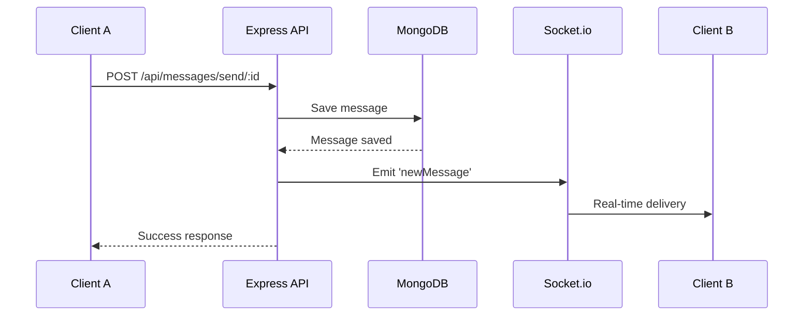

QuickChat is a real-time web chat application built with a modern full-stack architecture. The system consists of a Node.js/Express backend, MongoDB database, and Socket.io for real-time bidirectional communication.

## Architecture components

The application follows a three-tier architecture pattern:

<Steps>
  <Step title="Presentation layer">
    React-based client application that provides the user interface for chat interactions
  </Step>
  
  <Step title="Application layer">
    Express.js server handling REST API endpoints, authentication, and business logic
  </Step>
  
  <Step title="Data layer">
    MongoDB database storing user profiles, messages, and application state
  </Step>
</Steps>

## Technology stack

### Backend

- **Node.js** - Runtime environment
- **Express.js** - Web application framework
- **Socket.io** - Real-time WebSocket communication
- **Mongoose** - MongoDB object modeling
- **Cloudinary** - Image upload and storage

### Database

- **MongoDB** - NoSQL document database for flexible data storage

### Client

- **React** - Frontend UI framework
- **Vite** - Build tool and development server

## Server architecture

The server is structured following the MVC pattern:

```
server/
├── server.js              # Entry point, Socket.io setup
├── controllers/           # Business logic
│   ├── userController.js
│   └── msgController.js
├── models/               # Mongoose schemas
│   ├── user.js
│   └── message.js
├── routes/               # API endpoints
│   ├── userRoute.js
│   └── msgRoute.js
├── middleware/           # Authentication & validation
│   └── auth.js
└── lib/                  # Utilities
    ├── db.js            # Database connection
    ├── cloudinary.js    # Image service
    └── utils.js         # Helper functions
```

## Communication flow

### REST API communication

For standard CRUD operations, the client communicates with the server through RESTful endpoints:

1. Client sends HTTP request to Express route
2. Middleware validates authentication (JWT token)
3. Controller executes business logic
4. Model interacts with MongoDB
5. Response sent back to client

### Real-time communication

For instant messaging and presence updates, the application uses Socket.io:

1. Client establishes WebSocket connection with `userId` in query
2. Server stores user's socket ID in `userSocketmap`
3. Server broadcasts online users to all connected clients
4. When a message is sent:
   - Saved to MongoDB via REST API
   - Emitted to receiver's socket in real-time
5. On disconnect, user removed from `userSocketmap`

<Note>
The hybrid approach uses REST for data persistence and WebSocket for real-time updates, providing both reliability and instant delivery.
</Note>

## Data flow for sending messages



## Key architectural decisions

### Dual communication channels

QuickChat uses both HTTP and WebSocket protocols:

- **HTTP/REST**: Message persistence, authentication, user management
- **WebSocket**: Real-time message delivery, online presence

This ensures messages are stored reliably while providing instant delivery when users are online.

### User-to-socket mapping

The server maintains a `userSocketmap` object that maps user IDs to socket IDs:

```javascript
export const userSocketmap = {}; // {userId: socketId}
```

This allows the server to:
- Track which users are currently online
- Send messages to specific users by their user ID
- Broadcast presence updates efficiently

<Tip>
The socket map is stored in memory for fast lookups. In a production environment with multiple server instances, consider using Redis for shared state.
</Tip>

### Image handling

Images are uploaded to Cloudinary rather than stored directly in MongoDB:

- Reduces database size
- Leverages Cloudinary's CDN for fast delivery
- Automatic image optimization and transformations
- Only the secure URL is stored in the Message document

### Message seen status

Messages include a `seen` boolean field that tracks read receipts:

- Automatically set to `true` when user fetches conversation
- Can be manually updated via dedicated endpoint
- Used to display unread message counts in the sidebar

## Deployment architecture

The application is designed for serverless deployment:

```javascript
// server/server.js:51-54
if (process.env.NODE_ENV !== "production") {
  const PORT = process.env.PORT || 5000;
  server.listen(PORT, () => console.log("Server is running on " + PORT));
}

export default server; // For Vercel deployment
```

<Warning>
Socket.io requires persistent connections. Ensure your hosting platform supports WebSockets when deploying to production.
</Warning>

## Security considerations

- JWT-based authentication protects API endpoints
- Password hashing before storage
- CORS configured for cross-origin requests
- Protected routes use `protectRoute` middleware
- User passwords excluded from query responses

## Scalability notes

For scaling beyond a single server instance:

1. **Socket.io adapter**: Use Redis adapter for multi-server Socket.io
2. **Database**: MongoDB supports horizontal scaling with sharding
3. **Session storage**: Move from in-memory to Redis
4. **Load balancing**: Enable sticky sessions for Socket.io connections

## Related documentation

- [Database schema](/architecture/database) - Detailed model documentation
- [WebSocket implementation](/architecture/websockets) - Socket.io events and handlers