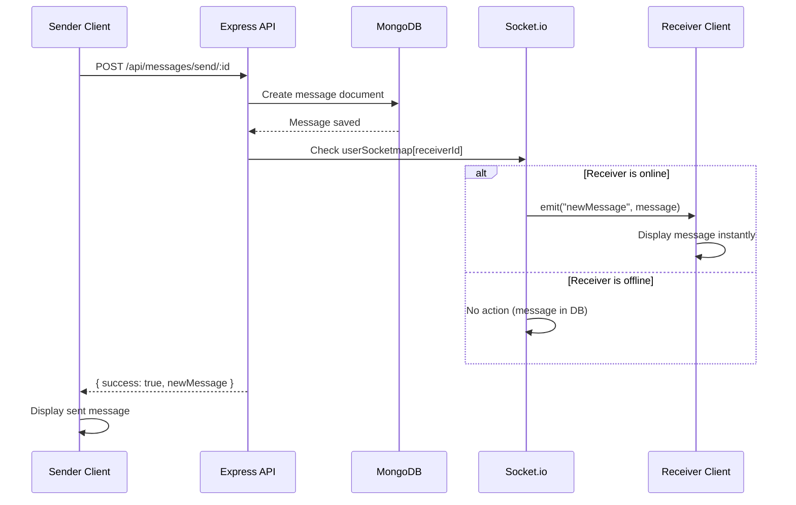

QuickChat uses Socket.io to provide real-time features including instant message delivery and online user presence. Socket.io enables bidirectional communication between the client and server over WebSocket connections.

## Socket.io server setup

The Socket.io server is initialized alongside the Express HTTP server:

```javascript
// server/server.js
import express from "express";
import http from "http";
import { Server } from "socket.io";

// Create Express app and HTTP server
const app = express();
const server = http.createServer(app);

// Initialize Socket.io server
export const io = new Server(server, {
  cors: { origin: "*" },
});

// Store online users
export const userSocketmap = {}; // {userId: socketId}
```

<Note>
The Socket.io server is attached to the HTTP server, not the Express app directly. This allows both HTTP and WebSocket protocols to share the same port.
</Note>

### CORS configuration

The server allows connections from any origin with `cors: { origin: "*" }`. In production, restrict this to your client domain:

```javascript
export const io = new Server(server, {
  cors: { 
    origin: "https://your-client-domain.com",
    credentials: true
  },
});
```

<Warning>
Using `origin: "*"` in production is a security risk. Always specify allowed origins explicitly.
</Warning>

## User-to-socket mapping

The server maintains an in-memory map of online users:

```javascript
export const userSocketmap = {}; // {userId: socketId}
```

This map enables:
- **Presence tracking**: Know which users are currently online
- **Direct messaging**: Send events to specific users by their user ID
- **Broadcast optimization**: Emit events only to online users

### Map structure

```javascript
{
  "507f1f77bcf86cd799439011": "abc123xyz",
  "507f191e810c19729de860ea": "def456uvw",
  "507f1f77bcf86cd799439012": "ghi789rst"
}
```

- **Key**: MongoDB User `_id` (user ID)
- **Value**: Socket.io socket ID (unique per connection)

## Socket.io events

### Connection event

Triggered when a client establishes a WebSocket connection:

```javascript
// server/server.js:23-30
io.on("connection", (socket) => {
  const userId = socket.handshake.query.userId;
  console.log("User connected", userId);

  if (userId) userSocketmap[userId] = socket.id;

  // Emit online users to all connected clients
  io.emit("getOnlineUsers", Object.keys(userSocketmap));
});
```

**Flow:**

<Steps>
  <Step title="Client connects">
    Client initiates WebSocket connection with `userId` in query parameters
  </Step>
  
  <Step title="Extract user ID">
    Server extracts `userId` from `socket.handshake.query`
  </Step>
  
  <Step title="Store mapping">
    User ID and socket ID are stored in `userSocketmap`
  </Step>
  
  <Step title="Broadcast presence">
    Server broadcasts updated list of online users to all connected clients
  </Step>
</Steps>

**Client-side connection example:**

```javascript
import io from "socket.io-client";

const socket = io("http://localhost:5000", {
  query: {
    userId: currentUser._id
  }
});
```

### Disconnect event

Triggered when a client closes the WebSocket connection:

```javascript
// server/server.js:32-36
socket.on("disconnect", () => {
  console.log("User Disconnected", userId);
  delete userSocketmap[userId];
  io.emit("getOnlineUsers", Object.keys(userSocketmap));
});
```

**Flow:**

<Steps>
  <Step title="Client disconnects">
    Connection is closed (tab closed, network lost, etc.)
  </Step>
  
  <Step title="Remove from map">
    User's entry is deleted from `userSocketmap`
  </Step>
  
  <Step title="Update presence">
    Updated online user list is broadcast to all remaining clients
  </Step>
</Steps>

<Tip>
The `userId` variable is accessible inside the disconnect handler because it's captured in the closure from the outer `connection` handler.
</Tip>

### getOnlineUsers event

Broadcast event sent to all clients when online presence changes:

```javascript
io.emit("getOnlineUsers", Object.keys(userSocketmap));
```

**Payload structure:**

```javascript
[
  "507f1f77bcf86cd799439011",
  "507f191e810c19729de860ea",
  "507f1f77bcf86cd799439012"
]
```

This is an array of user IDs currently connected to the server.

**Client-side listener:**

```javascript
socket.on("getOnlineUsers", (onlineUserIds) => {
  // Update UI to show online status
  setOnlineUsers(onlineUserIds);
});
```

### newMessage event

Emitted to a specific user when they receive a new message:

```javascript
// server/controllers/msgController.js:90-94
const receiverSocketId = userSocketmap[receiverId];
if (receiverSocketId) {
  io.to(receiverSocketId).emit("newMessage", newMessage);
}
```

**Flow:**

<Steps>
  <Step title="Message sent via REST">
    Sender posts message to `/api/messages/send/:id` endpoint
  </Step>
  
  <Step title="Save to database">
    Message is saved to MongoDB via Mongoose
  </Step>
  
  <Step title="Lookup receiver socket">
    Server checks if receiver is online in `userSocketmap`
  </Step>
  
  <Step title="Emit to receiver">
    If online, message is emitted directly to receiver's socket
  </Step>
</Steps>

**Payload structure:**

```javascript
{
  _id: "507f1f77bcf86cd799439013",
  senderId: "507f1f77bcf86cd799439011",
  receiverId: "507f191e810c19729de860ea",
  text: "Hello there!",
  image: "https://res.cloudinary.com/...",
  seen: false,
  createdAt: "2026-03-03T10:30:00.000Z",
  updatedAt: "2026-03-03T10:30:00.000Z"
}
```

**Client-side listener:**

```javascript
socket.on("newMessage", (message) => {
  // Add message to chat UI
  setMessages((prev) => [...prev, message]);
  
  // Play notification sound
  playNotificationSound();
});
```

<Note>
The message is only emitted if the receiver is currently online. If offline, they'll retrieve the message via REST API when they reconnect.
</Note>

## Message delivery flow

Here's the complete flow for sending and receiving messages:



### Key characteristics

- **Dual persistence and delivery**: Message is saved to database AND sent via WebSocket
- **Graceful degradation**: If receiver is offline, message waits in database
- **No message loss**: REST API ensures delivery even if WebSocket fails
- **Instant delivery**: Online users receive messages immediately via Socket.io

## Socket.io in message controller

The message controller imports the Socket.io instance to emit events:

```javascript
// server/controllers/msgController.js:4
import { io, userSocketmap } from "../server.js";
```

This allows controllers to send real-time events during REST operations:

```javascript
export const sendMessage = async (req, res) => {
  // ... save message to database ...
  
  // Real-time delivery
  const receiverSocketId = userSocketmap[receiverId];
  if (receiverSocketId) {
    io.to(receiverSocketId).emit("newMessage", newMessage);
  }
  
  // REST response
  res.json({ success: true, newMessage });
};
```

## Broadcasting patterns

### Broadcast to all clients

Send event to every connected client:

```javascript
io.emit("getOnlineUsers", Object.keys(userSocketmap));
```

### Send to specific socket

Send event to one client by socket ID:

```javascript
io.to(socketId).emit("newMessage", message);
```

### Send to specific user

Lookup user's socket ID, then send:

```javascript
const receiverSocketId = userSocketmap[userId];
if (receiverSocketId) {
  io.to(receiverSocketId).emit("eventName", data);
}
```

### Exclude sender from broadcast

If you need to broadcast to all except the sender:

```javascript
socket.broadcast.emit("eventName", data);
```

## Connection lifecycle

### Client connects

1. Client establishes WebSocket handshake
2. Server creates socket instance with unique ID
3. `connection` event fires on server
4. User ID extracted from query parameters
5. Mapping stored: `userSocketmap[userId] = socket.id`
6. Online users list broadcast to all clients

### Client disconnects

1. Connection closes (intentional or network issue)
2. `disconnect` event fires on server
3. User removed from `userSocketmap`
4. Updated online users list broadcast
5. Socket instance destroyed

### Reconnection

1. Client automatically attempts reconnection
2. New socket ID generated
3. `userSocketmap` updated with new socket ID
4. Previous socket ID is automatically invalidated

<Tip>
Socket.io handles reconnection automatically with exponential backoff. Configure retry options in client connection settings.
</Tip>

## Testing WebSocket connections

You can test Socket.io events using browser console:

```javascript
import io from "socket.io-client";

const socket = io("http://localhost:5000", {
  query: { userId: "your-user-id" }
});

// Listen for events
socket.on("getOnlineUsers", (users) => {
  console.log("Online users:", users);
});

socket.on("newMessage", (message) => {
  console.log("New message:", message);
});

// Check connection status
console.log("Connected:", socket.connected);
```

## Scalability considerations

The current implementation stores `userSocketmap` in server memory, which works for single-instance deployments.

### Multi-server deployment

For horizontal scaling across multiple servers:

1. **Use Redis adapter** for Socket.io
2. **Share state** across server instances
3. **Enable sticky sessions** at load balancer

```javascript
import { createAdapter } from "@socket.io/redis-adapter";
import { createClient } from "redis";

const pubClient = createClient({ url: "redis://localhost:6379" });
const subClient = pubClient.duplicate();

await Promise.all([pubClient.connect(), subClient.connect()]);

io.adapter(createAdapter(pubClient, subClient));
```

<Warning>
Without Redis adapter, users on different servers cannot communicate. The socket map is local to each server instance.
</Warning>

## Error handling

### Connection errors

Handle connection failures gracefully:

```javascript
socket.on("connect_error", (error) => {
  console.error("Connection failed:", error);
  // Notify user of connection issues
});
```

### Missing user ID

The server checks for `userId` before storing the mapping:

```javascript
if (userId) userSocketmap[userId] = socket.id;
```

If `userId` is missing, the connection is allowed but the user won't appear online.

<Tip>
Consider disconnecting clients that don't provide a valid `userId` to prevent anonymous connections.
</Tip>

## Security best practices

- **Authenticate connections**: Validate JWT token in Socket.io handshake
- **Restrict origins**: Configure CORS with specific allowed domains
- **Rate limiting**: Prevent spam by limiting message frequency
- **Input validation**: Validate all event payloads on server
- **Namespace isolation**: Use Socket.io namespaces for different features

## Related documentation

- [System architecture](/architecture/overview) - How Socket.io fits into the overall system
- [Database schema](/architecture/database) - Message model structure that gets delivered via WebSocket